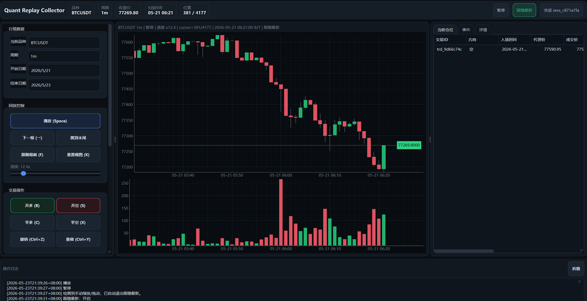
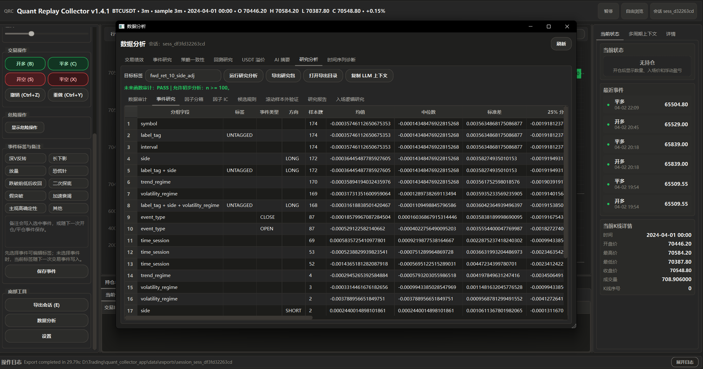
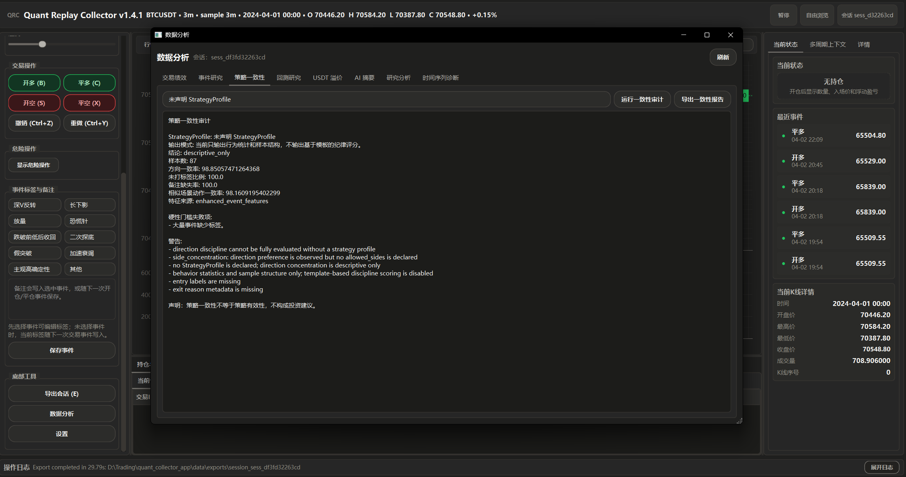

# Quant Replay Collector / 量化回放采集器

中文：Quant Replay Collector 是一个 Windows 桌面研究工具，用来回放加密货币 K 线，并把主观看盘判断整理成可记录、可审计、可导出的研究样本。
English: Quant Replay Collector is a Windows desktop research tool for replaying crypto K-line data and turning discretionary chart observations into structured, auditable, exportable research samples.

中文：它服务于复盘、标注和研究，不是实盘交易系统；它不连接 Binance 下单 API，不自动下单，也不提供投资建议。
English: It is built for review, annotation and research, not live execution; it does not connect to Binance order APIs, place trades, or provide investment advice.

## 截图 / Screenshots

中文：主回放工作区。
English: Main replay workspace.



中文：研究分析工作区。
English: Research analysis workspace.



中文：策略一致性面板。
English: Strategy consistency panel.



## 项目能做什么 / What It Does

- 中文：逐根回放市场 K 线，检查价格、成交量和上下文变化。 / English: Replay market candles bar by bar and inspect price, volume and context changes.
- 中文：在回放过程中记录人工开仓、平仓、标签和备注。 / English: Record manual open/close decisions, tags and notes during replay.
- 中文：生成事件窗口、决策时特征和后验结果标签，供后续研究使用。 / English: Build event windows, decision-time features and post-event outcome labels for later research.
- 中文：导出 CSV、JSON、Markdown 和 Parquet 研究文件。 / English: Export CSV, JSON, Markdown and Parquet research artifacts.
- 中文：运行只用于研究的事件研究、因子检查、时间序列诊断和回测。 / English: Run research-only event studies, factor checks, time-series diagnostics and backtests.
- 中文：检查一组交易是否符合已声明的策略规则，而不是只看盈利结果。 / English: Audit whether a set of trades follows a declared strategy profile instead of judging only profit.
- 中文：可选开启本地只读 API，给脚本或本地分析工具读取摘要数据。 / English: Optionally expose local read-only summary data through the app API layer.

## 当前范围 / Current Scope

- 中文：版本：`1.4.1`。 / English: Version: `1.4.1`.
- 中文：SQLite schema：`6`。 / English: SQLite schema: `6`.
- 中文：桌面技术栈：PySide6、pyqtgraph、pandas、numpy。 / English: Desktop stack: PySide6, pyqtgraph, pandas and numpy.
- 中文：主要运行环境：Windows PowerShell。 / English: Primary runtime environment: Windows PowerShell.
- 中文：运行时数据保存在 `quant_collector_app/data/`、`quant_collector_app/logs/` 以及缓存和导出目录。 / English: Runtime data is stored under `quant_collector_app/data/`, `quant_collector_app/logs/` and cache/export directories.

中文：这个项目默认本地优先。导出的统计、分数和报告只能作为研究证据，不能当作买卖信号。
English: The project is local-first by default. Exported statistics, scores and reports are research evidence, not buy/sell signals.

## 安装 / Install

中文：在仓库根目录创建虚拟环境并安装依赖。
English: From the repository root, create a virtual environment and install dependencies.

```powershell
python -m venv .venv
.\.venv\Scripts\python.exe -m pip install --upgrade pip
.\.venv\Scripts\python.exe -m pip install -r requirements.txt
```

中文：如果 `.venv` 已经存在，只需要重新执行最后一条安装命令。
English: If `.venv` already exists, rerun only the final install command.

## 运行 / Run

中文：推荐从仓库根目录启动桌面应用。
English: Launch the desktop app from the repository root.

```powershell
.\.venv\Scripts\python.exe run_app.py
```

中文：也可以使用包入口启动。
English: You can also launch it through the package entry point.

```powershell
.\.venv\Scripts\python.exe -m quant_collector_app
```

## 研究流程 / Research Workflow

中文：典型流程是先回放和标注，再抽取特征、隔离结果标签，最后做分析、导出和回测。
English: The typical flow is replay and annotation first, then feature extraction, outcome-label separation, analysis, export and backtesting.

```text
load/replay K-lines 加载/回放 K 线
  -> mark trades, events and observations 标记交易、事件和观察点
  -> extract decision-time context features 提取决策时可见特征
  -> keep post-event outcome labels separate 隔离后验结果标签
  -> analyze, export, backtest and review consistency 分析、导出、回测并检查一致性
```

中文：决策时特征和后验结果标签必须分开。研究模型只能使用决策点之前已经可见的数据；未来收益、MFE、MAE、胜负和止盈止损结果只能用于审计和报告。
English: Decision-time features and post-event outcome labels must stay separate. Research models may only use data visible at the decision point; forward returns, MFE, MAE, win/loss and stop/take outcomes are for audit and reporting only.

## 开仓逻辑研究 / Entry Logic Research

中文：Entry Logic Research 研究的是用户在深 V 反转做多场景中的开仓判断边界。监督标签是 `human_decision`，不是未来收益。
English: Entry Logic Research studies the user's long-entry judgment boundary in deep-V reversal setups. The supervised label is `human_decision`, not future return.

- 中文：`ENTRY`：用户在该决策点会考虑开多。 / English: `ENTRY`: the user would consider a long entry at that decision point.
- 中文：`REJECT`：用户明确拒绝该 setup。 / English: `REJECT`: the user rejects the setup.
- 中文：`UNCERTAIN`：信息不足或结构不清晰。 / English: `UNCERTAIN`: the setup is unclear or lacks enough information.
- 中文：`UNLABELED`：候选点尚未复核，不能自动当作负样本。 / English: `UNLABELED`: the candidate has not been reviewed and is not automatically a negative sample.

中文：`human_entry_similarity` 和 `setup_confidence` 这类分数只用于排序复核优先级，不是交易指令。
English: Scores such as `human_entry_similarity` and `setup_confidence` are review-prioritization signals, not trading instructions.

## 验证 / Validate

中文：使用项目虚拟环境运行验证，避免误用缺少依赖的系统 Python。
English: Run validation through the project virtual environment to avoid accidentally using an incomplete system Python.

```powershell
.\.venv\Scripts\python.exe -m compileall -q quant_collector_app tests
.\.venv\Scripts\python.exe -m pytest -q
.\.venv\Scripts\python.exe -m quant_collector_app.self_check --core
.\.venv\Scripts\python.exe scripts\clean_release.py --output dist\QuantReplayCollector-CI
.\.venv\Scripts\python.exe scripts\check_release_clean.py dist\QuantReplayCollector-CI
```

中文：`verify_before_push.bat` 会运行发布前的本地门禁。
English: `verify_before_push.bat` runs the local pre-push release gate.

## 干净发布策略 / Clean Release Policy

中文：`scripts/clean_release.py` 会生成公开源码包，并排除本地运行状态。
English: `scripts/clean_release.py` builds a public source package and excludes local runtime state.

- 中文：排除虚拟环境。 / English: Excludes virtual environments.
- 中文：排除旧的 `dist/` 输出。 / English: Excludes previous `dist/` output.
- 中文：排除本地 SQLite 数据库。 / English: Excludes local SQLite databases.
- 中文：排除日志、缓存、导出文件和本地设置。 / English: Excludes logs, caches, exports and local settings.
- 中文：排除 Python 缓存目录。 / English: Excludes Python cache directories.
- 中文：排除备份目录。 / English: Excludes backup folders.
- 中文：排除本地 agent 工作流文件。 / English: Excludes local agent workflow files.
- 中文：排除性能报告目录。 / English: Excludes performance-report directories.

中文：生成目录会包含 `clean_release_report.json` 和 `clean_release_report.md`。上传任何发布包之前，都要先对生成目录运行 `scripts/check_release_clean.py`。
English: The generated directory includes `clean_release_report.json` and `clean_release_report.md`. Run `scripts/check_release_clean.py` on that directory before uploading any release artifact.

## 项目结构 / Project Layout

中文：主要目录如下。
English: The main directories are listed below.

```text
quant_collector_app/       应用源码、服务、存储和研究模块 / app source, services, storage and research modules
quant_collector_app/views/ Qt 组件和展示辅助代码 / Qt widgets and presentation helpers
quant_collector_app/research/
                           事件、开仓逻辑和验证研究代码 / event, entry-logic and validation research code
quant_collector_app/backtesting/
                           只用于研究的回测引擎和策略 / research-only backtest engine and strategies
quant_collector_app/storage_core/
                           SQLite 迁移和仓储层 / SQLite migrations and repositories
scripts/                   诊断和干净发布工具 / diagnostics and clean-release tooling
tests/                     单元、集成和 GUI 邻近回归测试 / unit, integration and GUI-adjacent regression tests
docs/                      架构、发布、测试和研究文档 / architecture, release, testing and research notes
```

## 文档 / Documentation

- 中文：[架构](docs/architecture.md)。 / English: [Architecture](docs/architecture.md).
- 中文：[回测](docs/backtesting.md)。 / English: [Backtesting](docs/backtesting.md).
- 中文：[研究流程](docs/research_workflow.md)。 / English: [Research workflow](docs/research_workflow.md).
- 中文：[每日研究流程](docs/research_daily_workflow.md)。 / English: [Daily research workflow](docs/research_daily_workflow.md).
- 中文：[开仓逻辑研究](docs/research_entry_logic_modeling.md)。 / English: [Entry logic research](docs/research_entry_logic_modeling.md).
- 中文：[策略一致性](docs/strategy_consistency.md)。 / English: [Strategy consistency](docs/strategy_consistency.md).
- 中文：[测试](docs/testing.md)。 / English: [Testing](docs/testing.md).
- 中文：[发布卫生](docs/release.md)。 / English: [Release hygiene](docs/release.md).

## 许可证 / License

中文：本项目使用 MIT 许可证，详见 [LICENSE](LICENSE)。
English: This project uses the MIT license. See [LICENSE](LICENSE).