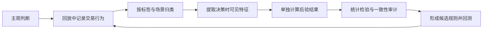
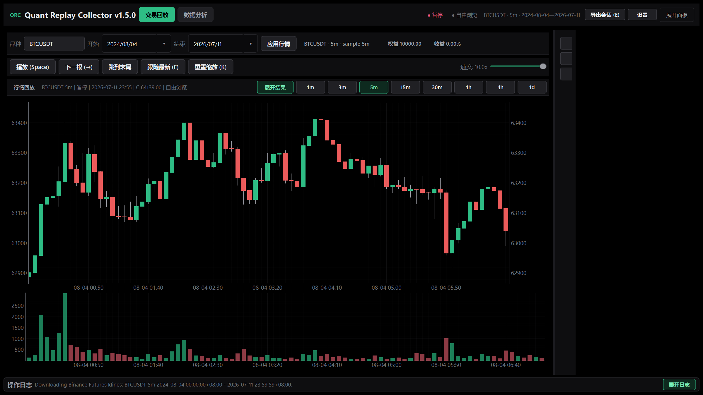

# Quant Replay Collector（QRC）

> 把主观交易策略变成可以记录、比较、检验和复现的数据。

很多主观交易者能在盘面上认出机会，却很难回答三个问题：当时到底看到了什么，为什么出手，同类场景下是否总会做出相近的决定。没有这些记录，复盘容易变成事后解释，策略也很难写成规则。

QRC 从这里入手。它逐根回放 K 线，保存用户当时的开仓、平仓、标签、备注和市场上下文；再把相似交易行为归到同一类 setup，分析每类行为对应的价格结构、波动、成交量、结果分布和执行习惯。研究者可以据此提出阈值、条件和退出规则，再用事件研究、时间序列诊断和回测去检验。

QRC 不承诺把经验一键变成盈利策略。它解决的是前一步：把散落在交易者脑中的判断，整理成有样本、有定义、能被反驳的候选规则。


```mermaid
flowchart LR
    A[主观判断] --> B[回放中记录交易行为]
    B --> C[按标签与场景归类]
    C --> D[提取决策时可见特征]
    D --> E[单独计算后验结果]
    E --> F[统计检验与一致性审计]
    F --> G[形成候选规则并回测]
    G --> B
```

## QRC 如何收集策略

交易发生时，QRC 保存方向、价格、时间、手续费、滑点、仓位、止盈止损、标签和备注。标签可以描述深 V 反转、长下影、放量、假突破、二次探底等盘面语言。系统同时保留当根 K 线之前已经出现的行情，之后的收益、MFE、MAE 和最终结果另行计算。

这套分离很重要。决策特征只能来自当时可见的数据，后验结果只用于标签和评估。否则，未来行情会混进策略输入，最后得到一个看起来很好、实际上无法交易的规则。

数据积累后，可以按 setup、方向、周期、市场状态或用户标签分组。QRC 不替用户编造交易逻辑，而是回答更具体的问题：哪些条件经常一起出现，哪些判断在相似场景中稳定，哪些规则只在少量样本上成立。

## 当前模块

| 模块 | 主要用途 |
| --- | --- |
| K 线回放与交易记录 | 逐根回放、自由缩放、调整速度，记录开平仓、止盈止损、标签和备注 |
| 样本与特征构建 | 生成决策时特征、事件窗口、后验标签和可追溯的样本索引 |
| 事件研究 | 比较事件前后收益、波动和路径，检查某类 setup 是否反复出现相近结果 |
| 策略一致性审计 | 检查样本量、方向集中度、标签完整度、风险元数据和相似场景下的动作一致性 |
| 金融时间序列分析 | 分析收益分布、自相关、白噪声、波动聚集、尾部风险、微观结构和多资产因子 |
| 研究型回测 | 在明确手续费、滑点、成交时点和持仓规则后，对候选规则做历史模拟 |
| 数据质量与泄漏审计 | 检查缺口、重复值、时间顺序、未来函数和训练/验证/测试边界 |
| 交易绩效 | 统计权益、已实现与浮动盈亏、胜率、盈亏比、夏普比率和最大回撤 |

### 策略一致性审计

一致性审计不评价交易者“守不守纪律”，也不把固定模板当成标准答案。它先看样本结构：同类场景里，方向是否过度集中，标签和退出原因是否缺失，动作是否反复变化，样本量是否足以支持结论。

一致性高，只能说明行为比较稳定；它不等于策略有效，更不等于未来盈利。QRC 会把这条边界写进审计报告。

### 金融时间序列分析

时间序列模块研究行情本身。当前包含收益率分布、Jarque-Bera 正态性诊断、Ljung-Box 序列依赖、波动聚集、历史与 EWMA VaR/ES、尾部损失、短周期噪声近似诊断，以及多资产数据可用时的因子分析。

这些结果用于判断数据的统计性质和建模限制，不直接生成买卖信号。短周期 K 线也不能代替逐笔成交或盘口数据。

## 当前界面

### 交易回放与行为采集



### 数据分析工作区


### 策略一致性审计


### 金融时间序列诊断


截图可通过以下命令从当前代码重新生成：

```powershell
$env:QT_QPA_PLATFORM='windows'
.\.venv\Scripts\python.exe scripts\capture_readme_screenshots.py
```

## 安装与启动

QRC 面向 Windows 桌面环境。建议使用仓库内的虚拟环境：

```powershell
git clone https://github.com/Vinnnnnie21/quant-replay-collector.git
cd quant-replay-collector
python -m venv .venv
.\.venv\Scripts\python.exe -m pip install --upgrade pip
.\.venv\Scripts\python.exe -m pip install -r requirements.txt
.\start.bat
```

`start.bat` 使用 `pythonw` 启动，不会额外弹出命令行窗口。排查启动问题时使用：

```powershell
.\.venv\Scripts\python.exe run_app.py
```

也可以直接运行包入口：

```powershell
.\.venv\Scripts\python.exe -m quant_collector_app
```

## 数据与研究边界

- 数据库、行情缓存、导出结果、日志和个人设置只保存在本地，默认不会提交到 Git。
- 决策时特征与后验结果分开存放。未来收益、MFE、MAE、胜负和事件后窗口不能进入模型输入。
- 回测结果依赖手续费、滑点、成交规则、样本区间和参数选择。历史表现不代表未来结果。
- QRC 不连接交易所下单 API，不自动交易，也不提供投资建议。

## 发布前检查

```powershell
.\.venv\Scripts\python.exe -m compileall -q quant_collector_app tests
.\.venv\Scripts\python.exe -m pytest -q
.\.venv\Scripts\python.exe -m quant_collector_app.self_check --all
.\.venv\Scripts\python.exe scripts\clean_release.py --output dist\QuantReplayCollector-CI
.\.venv\Scripts\python.exe scripts\check_release_clean.py dist\QuantReplayCollector-CI
```

## 代码与文档

- `quant_collector_app/`：桌面应用、研究模块、存储层和导出逻辑
- `quant_collector_app/views/`：主窗口与界面组件
- `quant_collector_app/analysis/`、`quant_collector_app/time_series_analysis/`：特征、审计和时间序列分析
- `quant_collector_app/backtesting/`：研究型回测与时间切分
- `scripts/`：诊断、性能分析、发布检查和截图生成
- `tests/`：业务逻辑、数据边界、UI 合同和回归测试

进一步阅读：

- [研究工作流](docs/research_workflow.md)
- [每日研究流程](docs/research_daily_workflow.md)
- [开仓逻辑研究](docs/research_entry_logic_modeling.md)
- [策略一致性](docs/strategy_consistency.md)
- [金融时间序列分析](docs/time_series_analysis.md)
- [回测说明](docs/backtesting.md)
- [系统架构](docs/architecture.md)
- [测试说明](docs/testing.md)

## English summary

QRC records discretionary trading decisions during bar-by-bar replay, groups similar behaviors into setups, separates decision-time features from later outcomes, and provides consistency audits, financial time-series diagnostics, event studies and research backtests. Its purpose is to turn a trader's repeatable judgment process into explicit hypotheses that can be tested with data.

## 许可证

[MIT License](LICENSE)
