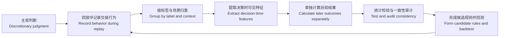
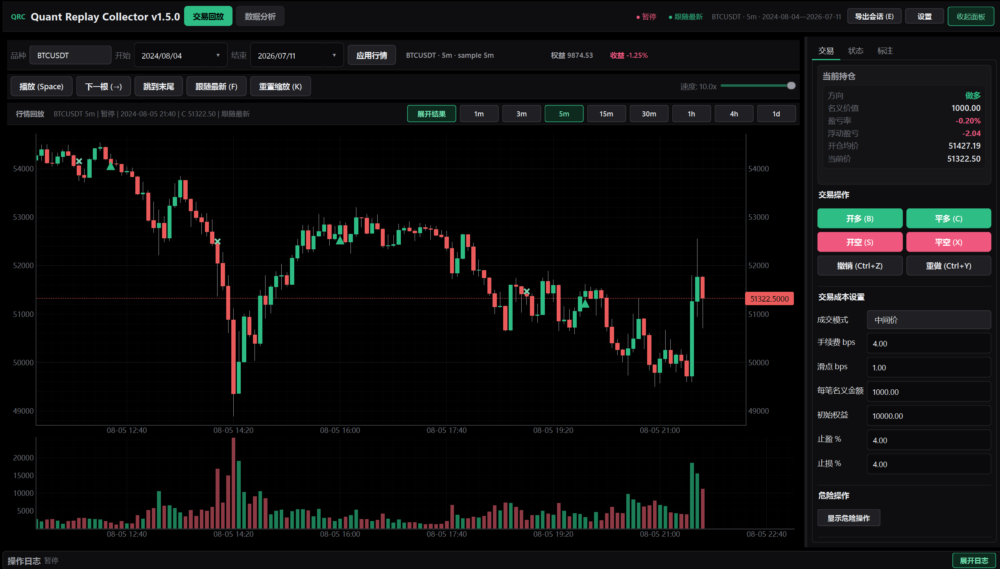
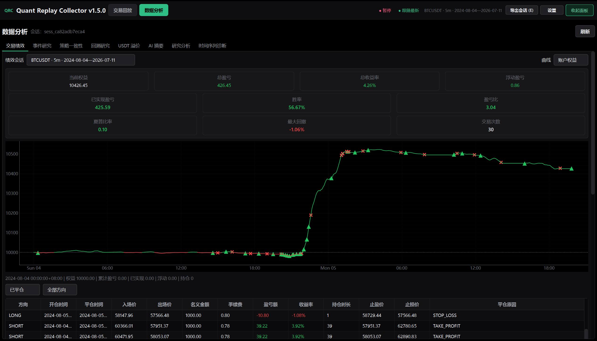
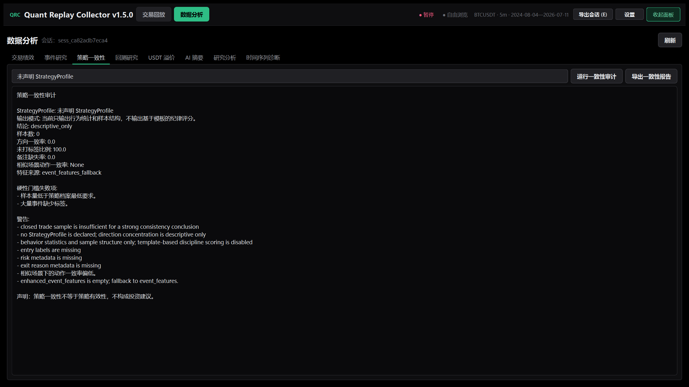
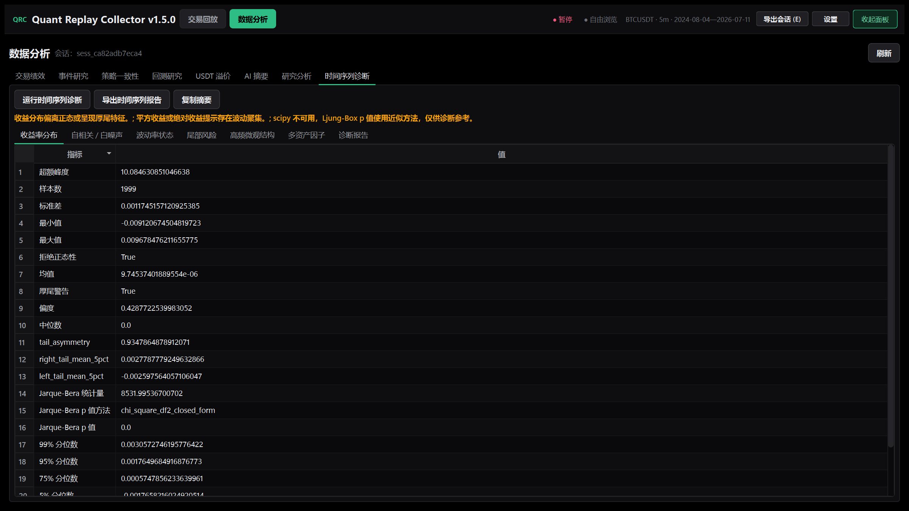

# Quant Replay Collector（QRC）

> 把主观交易策略变成可以记录、比较、检验和复现的数据。
>
> Turn discretionary trading strategies into data that can be recorded, compared, tested, and reproduced.

很多主观交易者能在盘面上认出机会，却很难说清当时看到了什么、为什么出手，以及同类场景下是否会做出相近的决定。缺少连续记录时，复盘容易变成事后解释，策略也很难写成可检验的规则。

Many discretionary traders can recognize an opportunity on a chart, but struggle to explain what they saw, why they acted, or whether they would make the same decision in a similar situation. Without a continuous record, review becomes hindsight and the strategy remains difficult to express as testable rules.

QRC 逐根回放 K 线，记录用户当时的开仓、平仓、标签、备注和市场上下文，再把相似交易行为归到同一类 setup。系统分析每类行为对应的价格结构、波动、成交量、结果分布和执行习惯，帮助研究者提出阈值、条件与退出规则，并用事件研究、时间序列诊断和回测检验这些假设。

QRC replays market data bar by bar, recording entries, exits, labels, notes, and the market context visible at the time. It groups similar trading behavior into setups, then analyzes price structure, volatility, volume, outcome distributions, and execution habits so researchers can propose thresholds, conditions, and exit rules and test them through event studies, time-series diagnostics, and backtests.

QRC 不承诺把经验一键变成盈利策略。它做的是更基础的工作：把散落在交易者脑中的判断整理成有样本、有定义、可以被数据反驳的候选规则。

QRC does not promise to turn experience into a profitable strategy with one click. Its job is more fundamental: convert the judgments in a trader's head into candidate rules with samples, definitions, and evidence that can prove them wrong.


```mermaid
flowchart LR
    A["主观判断<br/>Discretionary judgment"] --> B["回放中记录交易行为<br/>Record behavior during replay"]
    B --> C["按标签与场景归类<br/>Group by label and context"]
    C --> D["提取决策时可见特征<br/>Extract decision-time features"]
    D --> E["单独计算后验结果<br/>Calculate later outcomes separately"]
    E --> F["统计检验与一致性审计<br/>Test and audit consistency"]
    F --> G["形成候选规则并回测<br/>Form candidate rules and backtest"]
    G --> B
```

## QRC 如何收集策略 / How QRC captures a strategy

交易发生时，QRC 保存方向、价格、时间、手续费、滑点、仓位、止盈止损、标签和备注。标签可以描述深 V 反转、长下影、放量、假突破、二次探底等交易者熟悉的盘面语言。系统保留当根 K 线之前已经出现的行情；之后的收益、MFE、MAE 和最终结果则单独计算。

When a trade occurs, QRC stores its direction, price, time, fees, slippage, position size, take-profit and stop-loss settings, labels, and notes. Labels can describe familiar chart patterns such as a deep V reversal, long lower wick, volume expansion, false breakout, or secondary bottom. Market data visible before the decision is preserved, while later returns, MFE, MAE, and final outcomes are calculated separately.

这种分离是研究能否成立的前提。决策特征只能来自当时可见的数据，后验结果只用于标注和评估。否则未来行情会混进策略输入，得到一个历史上很好看、实际无法交易的规则。

This separation is necessary for valid research. Decision features may only use information available at the time, while later outcomes are reserved for labeling and evaluation. Mixing future data into strategy inputs creates rules that look strong in historical tests but cannot be traded in practice.

数据积累后，可以按 setup、方向、周期、市场状态或用户标签分组。QRC 不替用户编造交易逻辑，而是回答更具体的问题：哪些条件经常一起出现，哪些判断在相似场景中稳定，哪些规则只在少量样本上成立。

As the dataset grows, trades can be grouped by setup, direction, timeframe, market regime, or user label. QRC does not invent a trading thesis for the user. It helps answer narrower questions: which conditions tend to appear together, which decisions remain stable in comparable situations, and which apparent rules depend on only a few samples.

## 当前模块 / Current modules

| 模块<br>Module | 主要用途<br>Purpose |
| --- | --- |
| K 线回放与交易记录<br>Bar replay and trade capture | 逐根回放、自由缩放、调整速度，记录开平仓、止盈止损、标签和备注<br>Replay bar by bar, pan and zoom freely, control speed, and record entries, exits, risk settings, labels, and notes |
| 样本与特征构建<br>Sample and feature construction | 生成决策时特征、事件窗口、后验标签和可追溯的样本索引<br>Build decision-time features, event windows, outcome labels, and traceable sample indexes |
| 事件研究<br>Event studies | 比较事件前后收益、波动和路径，检查某类 setup 是否反复出现相近结果<br>Compare returns, volatility, and paths around events to test whether a setup produces similar outcomes repeatedly |
| 策略一致性审计<br>Strategy consistency audit | 检查样本量、方向集中度、标签完整度、风险元数据和相似场景下的动作一致性<br>Check sample size, directional concentration, label completeness, risk metadata, and action consistency in similar situations |
| 金融时间序列分析<br>Financial time-series analysis | 分析收益分布、自相关、白噪声、波动聚集、尾部风险、微观结构和多资产因子<br>Analyze return distributions, autocorrelation, white noise, volatility clustering, tail risk, microstructure, and multi-asset factors |
| 研究型回测<br>Research backtesting | 在明确手续费、滑点、成交时点和持仓规则后，对候选规则做历史模拟<br>Simulate candidate rules with explicit fees, slippage, execution timing, and position rules |
| 数据质量与泄漏审计<br>Data quality and leakage audit | 检查缺口、重复值、时间顺序、未来函数和训练、验证、测试边界<br>Check gaps, duplicates, time ordering, look-ahead leakage, and train-validation-test boundaries |
| 交易绩效<br>Trading performance | 统计权益、已实现与浮动盈亏、胜率、盈亏比、夏普比率和最大回撤<br>Measure equity, realized and floating PnL, win rate, profit factor, Sharpe ratio, and maximum drawdown |

### 策略一致性审计 / Strategy consistency audit

一致性审计不评价交易者“守不守纪律”，也不把固定模板当成标准答案。它先检查样本结构：同类场景里，方向是否过度集中，标签和退出原因是否缺失，动作是否反复变化，样本量是否足以支撑结论。

The consistency audit does not judge whether a trader is disciplined, nor does it treat a fixed template as the correct answer. It first examines the sample structure: whether direction is overly concentrated, labels or exit reasons are missing, actions vary repeatedly in similar situations, and the sample size can support a conclusion.

一致性高只说明行为比较稳定，不代表策略有效，更不代表未来盈利。审计报告会明确保留这条边界。

High consistency only means behavior is relatively stable. It does not prove that a strategy works or will remain profitable, and the audit report states this limitation explicitly.

### 金融时间序列分析 / Financial time-series analysis

时间序列模块研究行情本身。当前包含收益率分布、Jarque-Bera 正态性诊断、Ljung-Box 序列依赖、波动聚集、历史与 EWMA VaR/ES、尾部损失、短周期噪声近似诊断，以及多资产数据可用时的因子分析。

The time-series module studies the market data itself. It currently covers return distributions, Jarque-Bera normality diagnostics, Ljung-Box serial-dependence tests, volatility clustering, historical and EWMA VaR/ES, tail losses, approximate short-horizon noise diagnostics, and factor analysis when multi-asset data is available.

这些结果用于判断数据的统计性质和建模限制，不直接生成买卖信号。短周期 K 线也不能代替逐笔成交或盘口数据。

These results describe the statistical properties and modeling limits of the data; they do not directly generate trading signals. Short-interval bars are also not a substitute for tick or order-book data.

## 当前界面 / Current interface

### 主页 / Home



### 数据分析工作区 / Data analysis workspace



### 策略一致性审计 / Strategy consistency audit



### 金融时间序列诊断 / Financial time-series diagnostics



截图可以通过以下命令从当前代码重新生成：

The screenshots can be regenerated from the current code with the following command:

```powershell
$env:QT_QPA_PLATFORM='windows'
.\.venv\Scripts\python.exe scripts\capture_readme_screenshots.py
```

## 安装与启动 / Installation and startup

QRC 面向 64 位 Windows 和 Python 3.13。建议使用仓库内的虚拟环境和已验证的锁定依赖：

QRC supports 64-bit Windows with Python 3.13. Use a repository-local virtual environment and the verified dependency lock:

```powershell
git clone https://github.com/Vinnnnnie21/quant-replay-collector.git
cd quant-replay-collector
py -3.13 -m venv .venv
.\.venv\Scripts\python.exe -m pip install --upgrade pip
.\.venv\Scripts\python.exe -m pip install -r requirements.txt
.\start.bat
```

`start.bat` 使用 `pythonw` 启动，不会额外弹出命令行窗口。排查启动问题时使用下面的命令：

`start.bat` launches the application through `pythonw`, so it does not open an additional command window. Use the command below when diagnosing startup problems:

```powershell
.\.venv\Scripts\python.exe run_app.py
```

也可以直接运行包入口：

You can also run the package entry point directly:

```powershell
.\.venv\Scripts\python.exe -m quant_collector_app
```

### Windows desktop shortcut

Build the Windows executable, then create a current-user desktop shortcut named `QRC.lnk`:

```powershell
cd quant_collector_app
.\build_windows.bat
cd ..
powershell.exe -NoProfile -ExecutionPolicy Bypass -File .\scripts\create_desktop_shortcut.ps1 -TargetPath .\quant_collector_app\dist\QRC.exe
```

The explicit `ExecutionPolicy Bypass` applies only to this script process, so it works on systems that block direct `.ps1` execution without changing the user's policy. The shortcut installer does not require administrator access and does not write to the registry. Use `-DryRun` to inspect `TargetPath`, `WorkingDirectory`, shortcut path and icon selection without creating a file. The application window uses `quant_collector_app/assets/app_logo.png` on dark themes and the transparent `quant_collector_app/assets/app_logo_light.png` on light themes. The packaged executable and shortcut use the fixed multi-size Windows icon at `quant_collector_app/assets/app_icon.ico`, generated from the dark-theme logo.

To replace the logos later, overwrite both PNG variants. Regenerate the Windows icon after changing the dark-theme logo:

```powershell
.\.venv\Scripts\python.exe scripts\generate_app_icon.py --source quant_collector_app\assets\app_logo.png --output quant_collector_app\assets\app_icon.ico
```

## 数据与研究边界 / Data and research boundaries

- 数据库、行情缓存、导出结果、日志和个人设置只保存在本地，默认不会提交到 Git。<br>Databases, market caches, exports, logs, and personal settings remain local and are excluded from Git by default.
- 决策时特征与后验结果分开存放。未来收益、MFE、MAE、胜负和事件后窗口不能进入模型输入。<br>Decision-time features are stored separately from later outcomes. Future returns, MFE, MAE, win/loss labels, and post-event windows must not enter model inputs.
- 回测结果依赖手续费、滑点、成交规则、样本区间和参数选择。历史表现不代表未来结果。<br>Backtest results depend on fees, slippage, execution rules, sample periods, and parameter choices. Historical performance does not guarantee future results.
- QRC 不连接交易所下单 API，不自动交易，也不提供投资建议。<br>QRC does not connect to exchange order APIs, place trades automatically, or provide investment advice.

## 发布前检查 / Pre-release checks

发布前运行完整测试、自检和干净构建检查：

Before publishing, run the complete tests, self-check, and clean-build validation:

```powershell
.\.venv\Scripts\python.exe -m compileall -q quant_collector_app tests
.\.venv\Scripts\python.exe -m pytest -q
.\.venv\Scripts\python.exe -m quant_collector_app.self_check --all
.\.venv\Scripts\python.exe scripts\clean_release.py --output dist\QuantReplayCollector-CI
.\.venv\Scripts\python.exe scripts\check_release_clean.py dist\QuantReplayCollector-CI
```

## 代码与文档 / Code and documentation

- `quant_collector_app/`：桌面应用、研究模块、存储层和导出逻辑<br>Desktop application, research modules, storage layer, and export logic
- `quant_collector_app/views/`：主窗口与界面组件<br>Main window and interface components
- `quant_collector_app/analysis/`、`quant_collector_app/time_series_analysis/`：特征、审计和时间序列分析<br>Features, audits, and time-series analysis
- `quant_collector_app/backtesting/`：研究型回测与时间切分<br>Research backtesting and temporal splits
- `scripts/`：诊断、性能分析、发布检查和截图生成<br>Diagnostics, performance analysis, release checks, and screenshot generation
- `tests/`：业务逻辑、数据边界、UI 合同和回归测试<br>Business logic, data boundaries, UI contracts, and regression tests

进一步阅读：

Further reading:

- [研究工作流 / Research workflow](docs/research_workflow.md)
- [每日研究流程 / Daily research workflow](docs/research_daily_workflow.md)
- [开仓逻辑研究 / Entry-logic research](docs/research_entry_logic_modeling.md)
- [策略一致性 / Strategy consistency](docs/strategy_consistency.md)
- [金融时间序列分析 / Financial time-series analysis](docs/time_series_analysis.md)
- [回测说明 / Backtesting](docs/backtesting.md)
- [系统架构 / Architecture](docs/architecture.md)
- [测试说明 / Testing](docs/testing.md)

## 许可证 / License

本项目采用 [MIT License](LICENSE)。

This project is licensed under the [MIT License](LICENSE).
