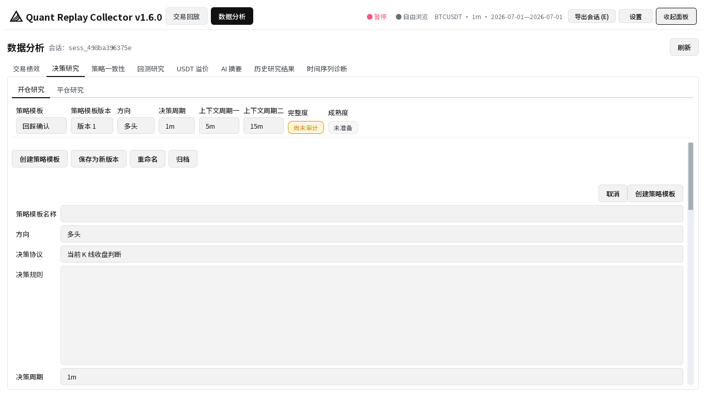
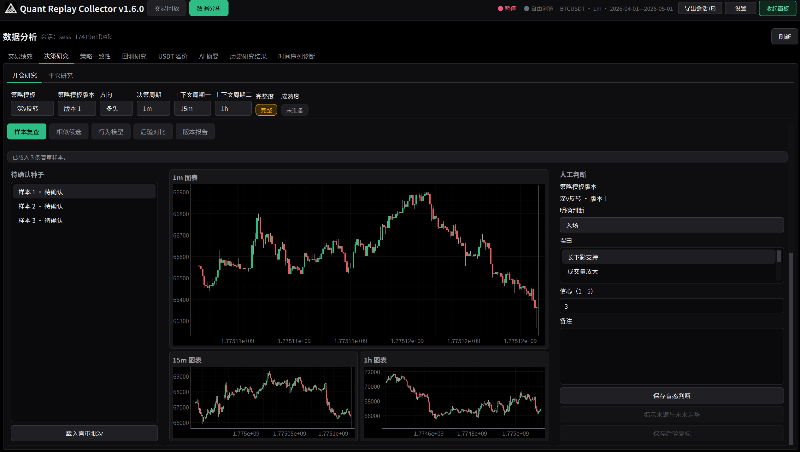

# Quant Replay Collector v1.6.0 中文操作教程

这份教程按 v1.6.0 正式界面编写。文中的研究功能用于整理和检查历史判断，不是买卖信号，也不会自动下单。

## 1. 安装和启动

下载 `QRC-v1.6.0-Windows-x64.zip` 后，先按发布页提供的 `checksums.txt` 核对 SHA-256，再把压缩包完整解压到固定目录。不要只复制 `QRC.exe`，也不要直接在压缩包里运行；程序需要同目录下的 `_internal`。

双击 `QRC.exe` 启动。标题应显示“Quant Replay Collector v1.6.0”。如果显示旧版本，检查快捷方式是否仍指向旧目录。

源码用户可在项目根目录运行：

```powershell
.\.venv\Scripts\python.exe run_app.py
```

## 2. 从旧版本升级

升级前正常退出旧程序。确认窗口已关闭、没有后台补齐或导出任务后，备份旧程序的数据目录。

- 源码运行：备份 `quant_collector_app\data`。
- 便携包：备份旧 `QRC.exe` 旁的 `data`。
- 如果另行配置过数据目录，也要一起备份缓存、设置和导出文件。

第一次用 v1.6.0 打开旧数据库时，程序会先创建升级前备份，再执行只增迁移。应用版本是 `1.6.0`，数据库 schema 当前是 19，两者不是同一个编号。schema 迁移不可逆；需要回退旧程序时，应恢复升级前数据库备份，不能直接让旧程序打开已升级数据库。

## 3. 启动前手工备份数据库

退出程序后，复制 `quant_replay.db` 到独立磁盘或带日期的备份目录。不要只备份 `-wal` 或 `-shm` 文件，也不要在程序运行时只复制主数据库文件。

建议同时保留：

- `quant_replay.db`；
- `cache` 行情缓存；
- `app_settings.json`、`theme_settings.json`；
- 已发布的研究报告和会话导出。

## 4. 界面区域

顶部有“交易回放”和“数据分析”两个主入口。右上角显示暂停/播放状态、品种、周期和日期范围，并提供“导出会话”“设置”和“展开面板/收起面板”。

“交易回放”包含行情参数、回放工具栏、主图、多周期背景、持仓和交易操作。右侧面板收起时不会删除状态；重新展开后仍显示当前交易参数和持仓。

“数据分析”包含交易绩效、决策研究、策略一致性、回测研究、USDT 溢价、AI 摘要、历史研究结果和时间序列分析。


## 5. 创建新会话

首次加载一组新的品种、样本周期和日期范围时，程序会建立当前绩效会话。操作方法：

1. 在顶部选择品种、开始日期和结束日期。
2. 点击“应用行情”。
3. 等待本地缓存读取或网络下载结束。
4. 检查标题区的品种、周期和区间是否正确。

程序启动时会尝试恢复最近会话。要回到以前的会话，使用“继续绩效会话”，选择目标后确认。切换会话前会保存当前状态。

显示周期与交易样本周期不一致时，程序会阻止记录交易。回到原样本周期，或按界面提示为当前周期建立新的会话，避免把不同周期的判断混在一起。

## 6. 导入或加载行情

选择参数后点击“应用行情”。程序会优先复用本地范围缓存，只下载缺失区间。缓存中的 K 线保留开高低收、成交量、计价币成交额、成交笔数和两项主动买入成交量；缺失值保持为空，不会改写成零。

日期范围改变后，界面会提示行情参数已更改。再次点击“应用行情”才会切换实际加载的数据。加载失败时，操作日志会说明是网络、缓存还是数据质量问题。

## 7. 使用交易回放

- “播放 (Space)”：开始或暂停逐根播放。
- “下一根 (→)”：前进一根 K 线。
- “跳到末尾”：直接到当前数据末端。
- “跟随最新 (F)”：让视图继续跟随播放位置。
- “重置缩放 (K)”：恢复默认可视范围。
- `1m`、`3m`、`5m` 等周期按钮：切换显示周期；交易记录仍受样本周期保护。

拖动和滚轮只改变图表视图，不改变回放位置。自由浏览状态会在顶部显示，按“跟随最新”返回播放位置。

## 8. 记录主观交易行为

在交易参数区设置名义金额、手续费、滑点、成交方式和可选的止盈止损。到达希望记录的位置后，可点击“开多”或“开空”。程序使用当时的回放 K 线和设置生成模拟交易，不接真实交易 API。

需要平仓时，从未平仓列表选中对应的独立持仓，再点击“平多”或“平空”。同方向、不同开仓价的持仓不会合并成一个均价仓位。

标签、备注、止盈止损和成交时点会随交易保存。不要用事后看到的行情补写“当时理由”；决策研究会把揭示前判断和后验复标分开保存。

## 9. 导出会话

点击右上角“导出会话”。导出任务在后台运行，可以安全取消。成功发布前先写临时目录，取消或失败不会覆盖上一次完整导出。

导出包含稳定英文机器字段；界面语言不会改变 JSON/CSV 键。导出目录可能含交易记录、研究结果和个人备注，分享前自行脱敏。

## 10. 进入数据分析

点击顶部“数据分析”。当前会话的绩效结果会在后台计算；切换到历史会话时不会阻塞主窗口。页面右上角“刷新”会重新请求当前可用数据。


## 11. 创建策略模板

进入“数据分析 → 决策研究”，停留在“开仓研究”或切换到“平仓研究”，点击“创建策略模板”。填写：

- 策略模板名称；
- 方向：多头或空头；
- 决策协议；
- 决策规则；
- 一个决策周期和两个更高周期背景。

保存后会产生“版本 1”。名称可以修正，模板也可以归档；这些操作不会改变历史版本。方向、规则、协议或周期有变化时，点击“保存为新版本”，不要试图覆盖旧版本。



## 12. 配置三个周期

决策周期用于作出判断，两个背景周期用于观察更高层结构。背景周期必须都高于决策周期，而且不能相同。例如 `1m / 15m / 1h` 合法，`15m / 5m / 1h` 或 `1m / 15m / 15m` 不合法。

页面会根据交易所支持的周期给出推荐。保存前可以调整，保存后要通过新版本改变。

## 13. 检查研究数据完整度

选好策略模板版本、品种和研究区间后，点击“检查完整度”。检查只读取本地数据库，不会联网。页面分别显示三个周期的：

- 完整 K 线数和预计 K 线数；
- 覆盖率；
- 缺失 K 线数量和时间段；
- 缺失的附加原始字段。

如果三周期都完整，状态显示“完整”。如有缺口，点击“补齐当前研究区间”；系统会自动包含公式预热和后验窗口，只请求最小缺失区间。补齐支持取消和重试，已经成功写入的分块会保留，缺失值不会写成零。

检查或补齐正在运行时不要重复点击。状态长时间不结束时，可先“取消”，等待按钮恢复，再点“重试”。安全退出会请求任务停止，不会强制终止线程。

## 14. 理解独立行情片段

页面把特征窗口或后验窗口互相重叠的样本归入同一个“独立行情片段”，即使它们来自不同品种或周期。这样可以避免一次市场波动被重复计算成多份独立证据。

页面显示片段数量、样本组成和自动/人工来源。使用“修正分组”合并或拆分时，系统创建新的不可变分组版本并记录理由；旧报告继续引用原分组，不会被静默改写。

## 15. 开仓研究完整流程

1. 在“开仓研究”选择策略模板版本和三周期。
2. “检查完整度”，必要时补齐研究区间。
3. 确认独立行情片段已生成。
4. 打开“样本复查”，点击“载入盲审批次”。
5. 只看截止线及之前的三周期图，选择“入场”“拒绝”或“不确定”，填写理由、1—5 信心和备注。
6. 点击“保存盲态判断”。
7. 点击“揭示来源与未来走势”，核对实际来源和后续路径。
8. 样本和片段数量达到门槛后，在“相似候选”扫描并生成下一批。
9. 用户主动训练“开仓选择倾向”，再运行“后验对比”。
10. 在“版本报告”检查草稿并发布研究版本。

实际开仓只是待确认种子，不会自动变成“入场”。没有开仓也不会自动记为“拒绝”。

## 16. 平仓研究完整流程

切换到“平仓研究”，继续使用原始开仓策略模板版本和方向。流程与开仓研究共用同一页面：完整度、样本复查、相似候选、行为模型、后验对比和版本报告。

平仓种子来自实际全量平仓或用户添加的持仓时点。判断选项是“立即平仓”“继续持有”或“不确定”。实际平仓不会自动成为“立即平仓”，普通未平仓 K 线也不会自动成为“继续持有”。

v1.6.0 不研究部分减仓比例。部分平仓会明确显示不支持，不会伪装成完整平仓样本。无法关联原始策略模板的旧平仓可以浏览和补标，但不能进入正式模型。

## 17. 待确认种子和人工判断

每个盲审批次最多 20 条，每个独立行情片段最多一条。待判断列表只显示匿名编号和进度，不通过颜色、顺序或提示泄露真实来源。

保存前，服务层已经移除未来 K 线、结果、真实来源、实际动作、评分和入队原因。不是把这些信息仅仅藏在控件后面。保存后才能主动揭示。

揭示后若改变标签，系统会追加“事后复标”版本。原盲态判断不变，复标样本永久排除在主要模型和正式匹配之外。



## 18. 相似候选

“相似候选”包含两种用途：

- 自由浏览：对两个已揭示样本查看总相似度、三个周期和四类特征分解。自由浏览过的候选不能进入正式模型或正式匹配。
- 正式候选：在成熟度和完整度达标后扫描未标注位置，按结构相似度和结构多样性组成盲审批次。

开仓正式候选至少需要 10 个完整的“入场”判断并覆盖 5 个独立行情片段；平仓候选使用对应的“立即平仓”判断和持仓片段。每个候选参考三个不同片段，不会用随机 K 线或低质量样本凑满批次。

相似度只决定复查优先级，不会自动写入人工判断，也不是机会排行榜。

## 19. 行为模型

点击“训练新版本”才会开始训练，程序不会自动重训。开仓页显示“开仓选择倾向”，平仓页显示“立即平仓选择倾向”。

模型只使用明确的原始盲态判断和决策时可见指标，按时间顺序和独立行情片段隔离验证。理由、信心、未来收益、最大有利/不利路径和事后复标都不能成为输入。

正分表示更接近历史上相应的人工选择。它不表示未来会上涨或下跌，不是胜率、盈利概率或买卖信号。没有稳定指标时，页面保存失败实验和原因，但不会发布模型版本。

## 20. 后验对比

“后验对比”只在结构匹配完成后连接未来路径。开仓比较“入场/拒绝”，平仓比较“立即平仓/继续持有”。研究执行价采用下一根决策 K 线开盘价；缺少下一根 K 线时结果不可用，不会用实际成交价替代。

页面保留 5 个观察窗口 × 3 个指标的完整矩阵。结论分为：

- 正式证据不足；
- 当前样本未显示可靠差异；
- 当前样本存在差异证据。

非显著项仍会显示和导出。结果不扣全部真实交易成本，也不证明策略有效。

## 21. 版本报告

“当前草稿”随当前选择和研究结果变化。“已发布版本”是不可修改的快照。

发布前检查草稿中的策略模板版本、三周期、数据质量、标签来源与排除项、独立行情片段、相似检索、模型、完整后验矩阵、限制和审计信息。点击“发布研究版本”后，程序先写临时目录并校验，再原子发布；取消或失败会保留上一次成功版本。

报告导出中文 Markdown、稳定英文键 JSON manifest、完整 CSV 和 PNG 图表。失败实验、证据不足和无稳定指标不会被删掉。策略假设卡只能是“仅行为画像”“探索性策略假设”或“待前瞻验证”，不会输出可交易策略。

## 22. “证据不足”是什么意思

“证据不足”表示当前数据没有达到预先规定的样本、片段、完整度或推断门槛。它不是“策略失败”，也不是等待程序自动补出结论。

页面会给出差额。应补充新的独立盲态判断或完善缺失数据，再创建新的研究版本。不要通过降低门槛、重复同一行情或删除不显著项来把状态改成通过。

## 23. 模型成熟度

成熟度由完整人工判断数量和独立行情片段覆盖共同决定。重复记录同一段行情不会等价增加成熟度。

“未准备”时仍可查看样本和自由浏览，但正式候选、训练或正式匹配会拒绝运行并显示还缺多少。达到门槛只代表可以执行规定的研究步骤，不代表模型可靠或可交易。

## 24. 不把研究状态当成交易信号

- 相似度高：只表示历史结构接近。
- 选择倾向高：只表示更像历史人工选择。
- 后验存在差异：只描述当前匹配样本，未包含所有交易成本，也没有前瞻验证。
- 策略假设卡：是下一步验证计划，不是下单指令。

不要根据页面颜色、单一分数或一份报告直接交易。

## 25. 数据备份和恢复

正常退出后复制整个数据目录最稳妥。恢复时：

1. 保留当前数据目录的副本。
2. 确认备份来自兼容的 schema。
3. 把备份恢复到与当前运行方式对应的数据位置。
4. 启动后检查会话、交易、策略模板和已发布报告。

不要混合复制不同时间点的主数据库和 `-wal`/`-shm` 文件。

## 26. 数据库版本不兼容

如果提示“数据库版本不兼容”，说明数据库 schema 高于当前程序支持版本。立即退出，不要反复尝试写入。

可选处理：升级到支持该 schema 的程序；或关闭程序后恢复与当前版本匹配的完整备份。不要手工降低 `PRAGMA user_version`，这不会撤销表结构和数据变化。

## 27. 软件启动慢

1. 确认程序目录不是网络盘，且 `_internal` 文件完整。
2. 检查杀毒软件是否每次重新扫描整个 onedir 包。
3. 确认没有把正式包放在仍在同步的大型云盘目录。
4. 用源码控制台入口查看错误；开发者可运行 `scripts/profile_startup.py`。
5. 如果恢复的会话包含大量历史数据，等待后台加载完成，不要连续点击“应用行情”。

不要通过删除数据库来“加速”启动。

## 28. 常见错误

### “检查完整度”没有变化

确认已选择策略模板版本、品种和有效日期范围。状态栏显示“正在后台检查”时等待终态；需要停止就点“取消”，任务结束后再“重试”。若按钮一直不恢复，正常退出并保留日志，不要强制结束线程后继续写库。

### 页面提示缺少已闭合 K 线

盲审图只读取截止线及之前的完整 K 线。检查样本时点、三周期缓存和完整度；正在形成的 K 线不会作为已闭合数据使用。

### 正式候选或模型按钮不可用

查看顶部完整度、成熟度和独立行情片段差额。人工样本查看通常仍可用，但依赖附加字段的正式操作会快速拒绝。

### 快捷方式仍打开旧版本

右键查看快捷方式目标，先用 `create_desktop_shortcut.ps1 -DryRun` 核对新 EXE、manifest、版本和哈希，再更新快捷方式。新快捷方式启动成功前不要删除旧 EXE。

## 29. 安全退出

直接关闭主窗口即可。程序会请求行情、分析、补齐、候选扫描、训练、后验比较、报告和备份任务协作停止，并等待线程安全结束。不会使用强制线程终止。

出现“正在安全退出”时等待窗口自行关闭。不要在写入或迁移过程中结束进程或关机。

## 30. 卸载但保留数据

退出程序，把数据目录、备份和需要的导出复制到保留位置，再删除程序文件。便携包的数据可能位于程序目录旁，因此不能在未备份时直接删除整个解压目录。

桌面快捷方式只是 `.lnk`，删除快捷方式不会删除数据。重新安装后，把备份恢复到新版本对应的数据目录，再启动验证。

## 31. 已知限制

- 只支持 64 位 Windows 正式包；开发环境固定 Python 3.13。
- 不接真实交易 API，不自动执行订单。
- 平仓研究只处理全量平仓。
- 短周期 K 线不能替代逐笔成交或盘口深度。
- 行为模型只总结历史人工选择。
- 后验比较不扣全部真实成本，不构成策略有效性证明。
- v1.6.0 不生成 PDF 研究报告。

## 32. 风险说明

QRC 的回放、相似度、模型、后验比较和报告都可能受数据质量、样本选择、市场变化、交易成本和人工标注偏差影响。软件不提供投资建议，不保证盈利。用户应独立判断、控制风险，并自行维护数据备份。
